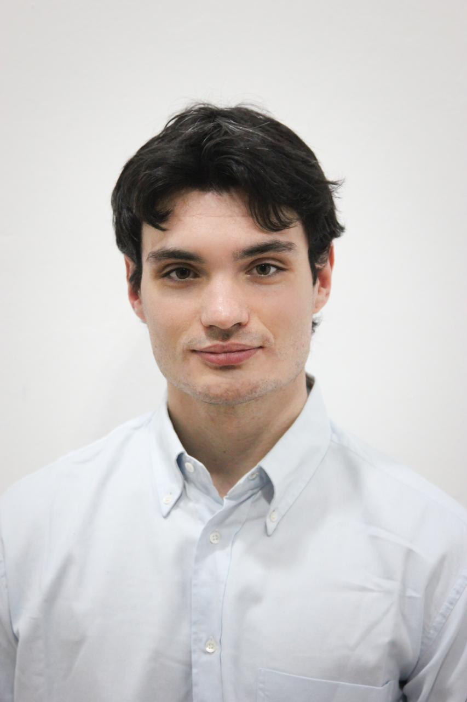

<html lang="en">
<head>
  <meta charset="UTF-8" />
  <meta name="viewport" content="width=device-width, initial-scale=1.0" />
  <title>Massimo Armano — Statistics & Data</title>
  <link rel="preconnect" href="https://fonts.googleapis.com" />
  <link rel="preconnect" href="https://fonts.gstatic.com" crossorigin />
  <link href="https://fonts.googleapis.com/css2?family=DM+Serif+Display:ital@0;1&family=DM+Mono:wght@400;500&family=DM+Sans:ital,opsz,wght@0,9..40,300;0,9..40,400;0,9..40,500;1,9..40,300&display=swap" rel="stylesheet" />
  
</head>
<body>

<nav>
  MA_portfolio.v2
  

    <a href="#about">About</a>
    <a href="#projects">Projects</a>
    <a href="assets/docs/CV_Armano_Massimo_.pdf" target="_blank" class="nav-cta">CV ↗</a>
  

</nav>

<!-- PAGE 1 — ABOUT -->
<section id="about">

  

    
    
Massimo Armano — Turin, Italy

  

  

    
MSc Statistics · Turin, Italy

    <h1>Massimo <em>Armano</em></h1>

    

      Recent graduate with strong quantitative skills and practical experience working with real datasets
    

    

    

  

    I hold a <strong>Master's degree in Statistical and Economic Methods for Decision-Making</strong>
    (LM-82) from the University of Turin, where I also received the <strong>Thesis Abroad Prize</strong>
    for a research project carried out at <strong>MaIAGE – INRAE</strong> in France. There, I implemented
    and applied a <strong>Bayesian factor model</strong> to <strong>wheat and biscuit NIRS data</strong>.
  

  

    Following my graduation, I continued to freelance working on this research through a collaboration between the
    <strong>University of Turin</strong> and <strong>MaIAGE – INRAE</strong>, with a temporary academic
    affiliation at the <strong>Department of Economics and Statistics “Cognetti De Martiis”</strong>.
    This led to a co-authored short paper on Bayesian factor models for NIRS data, submitted to SIS 2026.
    Motivated, adaptable, and driven by continuous learning, I'm open to opportunities in
    <strong>data science, data analysis, data engineering</strong>, and related fields where data and
    analytical thinking can generate real value.
  

    

      Python
      R
      SQL
      SAS · Stata
      Bayesian inference
      MCMC
      Statistical learning
      Power BI
      Data visualisation
      R Markdown
    

    

    
Contact &amp; links

    

      <a href="mailto:massimoarmano.ov@gmail.com" class="contact-link">
        ✉
        

          
Email

          
massimoarmano.ov@gmail.com

        

      </a>
      <a href="https://www.linkedin.com/in/massimo-armano-107174176/" target="_blank" class="contact-link">
        in
        

          
LinkedIn

          
massimo-armano

        

      </a>
      <a href="https://github.com/Massimo-ov" target="_blank" class="contact-link">
        ⌥
        

          
GitHub

          
Massimo-ov

        

      </a>
      <a href="assets/docs/CV_Armano_Massimo_.pdf" target="_blank" class="contact-link">
        ↓
        

          
Curriculum Vitae

          
Download PDF

        

      </a>
    

    <a href="#projects" class="scroll-cta">
      View my projects ↓
    </a>

  

</section>

<!-- PAGE 2 — PROJECTS -->
<section id="projects">

  

    <h2>Projects</h2>
    03 selected works
  

  

    

      
Master's Thesis

      <h3>Sparse Bayesian Infinite Factor Model</h3>
      
Application to NIRS Spectroscopy Data, Supervisors: A. Lanteri, G. Kon Kam King

      

        Application of a sparse Bayesian infinite factor model on biscuit dough and wheat near-infrared spectroscopy (NIRS) data.
        Includes hierarchical modelling, MCMC implementation via Gibbs sampling, posterior shrinkage analysis,
        and an in-depth interpretability study of latent factor structure. Culminating project of the MSc in
        Statistics at UniTo.
      

      

        Bayesian statistics
        Factor models
        MCMC / Gibbs sampling
        R
        NIRS data
        Dimensionality reduction
      

      

        <a href="assets/docs/thesis.pdf" target="_blank" class="project-link">↓ Thesis PDF</a>
        <a href="assets/docs/thesis_pres.pdf" target="_blank" class="project-link">↓ Presentation</a>
        <a href="https://github.com/Massimo-ov/Master-s-thesis-Sparse-Bayesian-infinite-factor-model-applications-on-NIRS-data-" target="_blank" class="project-link">⌥ GitHub</a>
      

    

    

      
University project — Spatial Statistics

      <h3>Variography &amp; Geostatistical Modelling</h3>
      
with Matteo Cucca, supervised by R. Ignaccolo (UniTo)

      

        Exploratory spatial analysis and variogram modelling project. Covers empirical variogram computation,
        theoretical model fitting (spherical, exponential, Matérn), and kriging interpolation. Fully implemented
        as a reproducible R Markdown workflow.
      

      

        Spatial statistics
        Variogram
        Kriging
        R / R Markdown
        Geostatistics
      

      

        <a href="assets/docs/HW4_Cucca_Armano.pdf" target="_blank" class="project-link">↓ Report PDF</a>
        <a href="assets/docs/STATISTICA SPAZIALE pres2024.pptx" target="_blank" class="project-link">↓ Presentation</a>
        <a href="https://github.com/Massimo-ov/UniTo-spatial-statistic-project-" target="_blank" class="project-link">⌥ GitHub</a>
      

    

    

      
Short paper — SIS Roma 2026 (submitted)

      <h3>NIRS Covariates via Sparse Bayesian Infinite Factor Models</h3>
      
with A. Lanteri &amp; G. Kon Kam King · UniTo; MaIAGE – INRAE

      

        Short paper <em>"Including Near-Infrared Spectroscopy Covariates via Sparse Bayesian Infinite Factor Models"</em>,
        submitted to the 53rd Meeting of the Italian Statistical Society (SIS Roma 2026). The GitHub repository covers
        the full modelling pipeline: data preprocessing, MCMC sampling, and results reporting for biscuit-dough
        NIRS datasets.
      

      

        Bayesian factor models
        NIRS
        R
        MCMC
        Reproducible research
      

      

        <a href="https://github.com/Massimo-ov/NIRS-via-SBIFM-SIS2026" target="_blank" class="project-link">⌥ GitHub</a>
      

    

  

  <a href="#about" class="back-top">↑ back to top</a>

</section>

<footer>© 2025 Massimo Armano — Statistics &amp; Data Science · Turin, Italy</footer>

</body>
</html>
